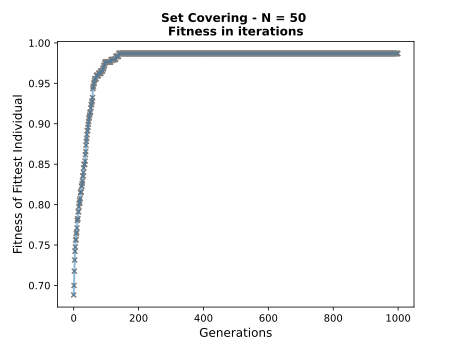
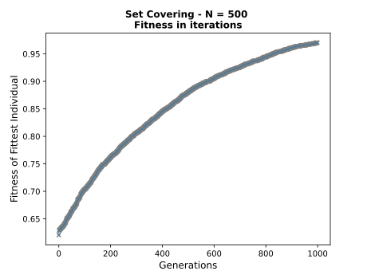

# Lab2 - Set Covering with evolutionary algorithms
This repo contains the solution to the second laboratory of the 2022/2023 Computational Intelligence. The problem specifications can be found [at this link](https://github.com/squillero/computational-intelligence/blob/master/2022-23/lab1_set-covering.ipynb). To address the problem, we used an evolutionary algorithm, as opposed to the search algorithms used during the first laboratory. 
## Authors
The contributors of this repo are:
* [Francesco Capuano](https://github.com/fracapuano/CompIntelligence_2022), s295366 
* [Matteo Matteotti](https://github.com/mttmtt31/compIntelligence_2022), s294552  

## Sources 
This solution mainly stems from the resolution of the [one-max problem](https://github.com/squillero/computational-intelligence/blob/master/2022-23/one-max.ipynb).

## Methodology
### Problem encoding
To better encode the problem, we turned the initial population from a list of lists into an array of booleans in the space $\R^P$.  

### Fitness of a candidate
Our methodology is strongly based on the definition of **fitness** of a given candidate, which has been slightly modified compared to what has been seen in class. 

Specifically, given a candidate, the `fitness()` function returns a float, evaluated as a weighted difference between the coverage of that candidate (*i.e.*, the proportion of the N digits are actually covered) and the bloat (*i.e.*, the total number of digits inside the candidate, min-max normalised), normalised between 0 and 1.

### The evolution
Our method evolves through a given number of generations. 
We implemented two different strategies: `comma`, which corresponds to the $(\lambda, \mu)$-strategy and `plus`, which corresponds to the $(\lambda + \mu)$-strategy.

A generation is defined as follows.

  1. **parents selection**: first, a subset of the total population of size `population_size` (*i.e.*, $\mu$) drawn. A further subset of size `tournament_size`  is drawn into a tournament, which returns the 2 fittest candidate, *i.e.*, the parents.
  2. **offspring generation**: the offspring is generated either as a random recombination (with probability `cross_probability`) of the two selected parents or as a random mutation of either parent. Specifically, a parent's random **mutation** considers the opposite gene in a locus, *i.e.*, considers the opposite of one entry in the encoded problem. This process is repeated ``offspring_size`` (*i.e.*, $\lambda$) times.
  3. **survival selection**: performed according to the strategy. If `comma`, only the best $\mu$ offspring's individuals are kept and become the new population. If `plus`, the offspring is entirely added to the population and only the best $\mu$ individuals are kept.

## Reproduce our results
To reproduce our results, set the seed to 42, and use the following values of hyperparameters:

| **hyperparameter** | **value** 
|:---:|:---:
| `population_size` | 20
| `offspring_size` | 30
| `cross_probability` | 0.7
| `tournament_size` | 6
| `max_generations` | 1000


Once the random seed is fixed to 42, to reproduce our results is sufficient to type in the command line: 

```bash
python3 solution.py
```

## Results
| **problem size** | **solution's cost** | **time elapsed (s)** |
|:---:|:---:|:---:|
| **5** | 5 | 9.13 |
| **10** | 15 | 11.18 |
| **20** | 20 | 7.14 |
| **50** | 101 | 17.54 |
| **100** | 230 | 34.48 |
| **500** | 10398 | 729.99 |
| **1000** | still running | still running |

Our results can also be visualized for what concerns the number evolution of the population along generations. It is possible to see that in the 1000 generations allowed, the majority of the problem sizes converged passing the elbow point (after which the relative improvement of the fittest individual could be considered marginal). 

From this standpoint it is also possible to see that the very large cost associated to the problem size `N=500` is mainly due to the fact that the number of generations was probably to small to allow the population to increase its fitness value. 

| | | |
|:-------------------------:|:-------------------------:|:-------------------------:|
||||
||||
