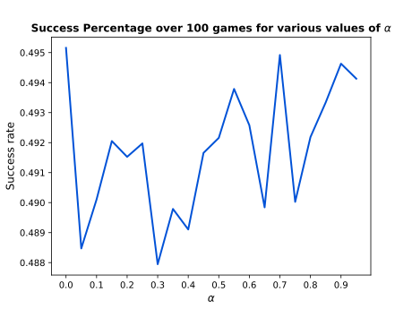
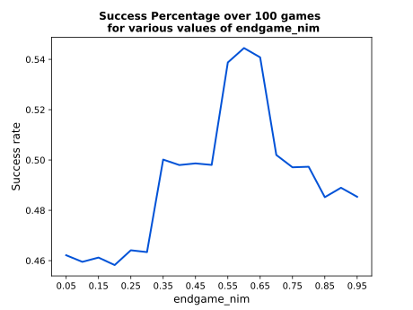
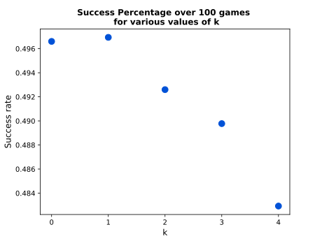
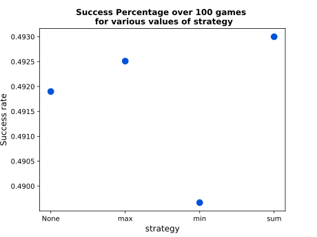

# Lab3 - Nim
This repo contains the solution to the third laboratory of the 2022/2023 Computational Intelligence. The problem specifications can be found [at this link](https://github.com/squillero/computational-intelligence/blob/master/2022-23/lab3_nim.ipynb). To address the problem, we initially (**Task 3.1**) hard-coded the best possible strategy (i.e., *nim-sum*). Later on (**Task 3.2**), we came up with parametric rules that granted us a significant success against a random agent.
> **NOTE**: This folder does not present full development history. Please refer to [Francesco's version](https://github.com/fracapuano/NimAgent) for full development history.

## Authors
The contributors of this repo are:
* [Francesco Capuano](https://github.com/fracapuano/CompIntelligence_2022), s295366 
* [Matteo Matteotti](https://github.com/mttmtt31/compIntelligence_2022), s294552  

# Nim
## Introduction
Nim is a mathematical game of strategy in which two players take turns removing objects from distinct rows, often referred to *heaps*.

As per the assignment instructions, we developed 2 different agents able to play Nim and there are two different ways to interact with them:

- each agent comes with a function which returns the best move to play given a Nim state, thus **returning the best move according to the agent without playing it**
- each agent can be challenged in a real Nim game, user vs agent, thus **playing the best move according to the agent**

## Agents
### Omni
*Omni* is the perfect agent. Basing its strategy on the nim-sum principles available [here](https://en.wikipedia.org/wiki/Nim#Mathematical_theory)), it always finds the best mathematical move which leaves its opponent hopeless (thus mathematically winning). 

### Evolved rules
We have identified 3 different phases of a Nim game. The best move in each phase is found according to some parametric rules.

- **Opening**: described as that phase of the game where there are less than $k$ heaps with at most $1$ element. In this phase, the performed action removes **ALL** elements from either the most populated heap with probability $\alpha$ or from the least populated heap with probability $1 - \alpha$.

- **Midgame**: phase between the opening and the endgame. In this phase, homogeneity is promoted. Namely, at each step, **the couple of values generating the largest pairwise variance is individuated**. Then, the largest value of the couple is set to be equal to the smallest one, provided that the latter is different from 0. When this is not the case, the latter is set to 1. Should each heap have the same number of objects (something like `[n, n, ..., n]`), one heap's population is decreased by 1. Since the largest pairwise variance is always the one between the least-populated heap and the most-populated one, we are considering weighted pairwise variances instead. One amongst the below **4 weighting strategies** (a practical example is provided below) should be passed to the `strategy` parameter:

  - `None` : each weight is set equal to 1.
  - `max` : each pairwise variance is weighted by the maximum number of objects in either heap. 
  - `min` : each pairwise variance is weighted by the minimum number of objects in either heap.
  - `sum` : each pairwise variance is weighted by the total number of objects in the two heaps.

- **Endgame**: phase where the number of heaps with more than one object is at most 1. In this phase, the agent removes a percentage of the most populated heap's elements proportional to the parameter `nim_endgame`. Should this be zero, one element will be removed.

#### Pairwise Variances (practical example)
e.g., Given heap A with 2 object and heap B with 6 objects, the `min`-weighted pairwise variance is: 
$2\times\frac{(2 - 4)^2 + (6 - 4)^2}{2}$, the `max`-weighted pairwise variance is: 
$6\times\frac{(2 - 4)^2 + (6 - 4)^2}{2}$ and the `sum`-weighted pairwise variance is: 
$8\times\frac{(2 - 4)^2 + (6 - 4)^2}{2}$. Lastly, the `None`-weighted pairwise variance is: 
$1\times\frac{(2 - 4)^2 + (6 - 4)^2}{2}$

The 4 parameters (`k`, `alpha`, `strategy`, `endgame`) can be set by the user. If not specified, the default choice for the parameters is the one resulting from a previously tested gridsearch where each configuration was let play 100 `Nim(5)` games against a random agent. The configuration which beated the random agent the most is the one set as default. 

The results of our grid search are presented in the following Figure, whereas the best configuration found for the parameters of our rules is: 

| Parameters|Best value |
|:-------------------------:|:-------------------------:|
|**k**|1|
|**$\alpha$**|0|
|**strategy**|`sum`|
|**endgame_nim**|0.6|

|Figure 1 | Grid search results |
|:-------------------------:|:-------------------------:|
|||
|||

## How to reproduce our results
The user can decide whether to play a real game against one of our agents, or to simply ask them which is the best move given a specific Nim configuration.

To do so, please use:

```bash
python solution.py
```

In addition to that, some arguments can be specified:

- `nim-dimension` : integer specifying the number of rows for your Nim game. The objects are distributed according to a pyramid where each row has a growing odd number of objects. Defaults to 5.
- `agent` : either 'omni' or 'rules'. Defaults to 'omni'.
- `grid-search` : when using the rule-based agent, whether to perform a grid search to find the best configuration of parameters given that specific Nim game. Defaults to False. If False, the default choice for the parameters is the one resulting from a previously tested gridsearch where each configuration was let play 100 `Nim(5)` games against a random agent. Please look at the csv file which comes with this repo to see all the results of that gridsearch.
- `print-best-config` : whether to print the best configuration of the grid search, or not. Defaults to False.
- `play-action` : if True, you will play a real game against one of your agent. Defaults to True.
- `return-action` : if True, the selected agent will simply return what it believes to be the best move. Defaults to False.
> **_NOTE:_** `play-action` and `return-action` cannot be both True or both False.
- `rule-alpha` : when using the rule-based agent, probability of nimming the biggest heap size row. Defaults to None.
- `rule-strategy` : when using the rule-based agent, strategy to use to weigh pairwise difference. One in ['min', 'max', 'sum']. Defaults to None.
- `rule-k` : when using the rule-based agent, number of heaps to eliminate during the opening phase. Defaults to None.
- `rule-endgame-nim` : when using the rule-based agent, percentage of elements to nim from the biggest row during the endgame phase. Defaults to None.

Should you wish to play a 4-row Nim game against the nim-sum agent, you should type:

```bash
python solution.py --agent omni --nim-dimension 4 --play-action True --return-action False
```
